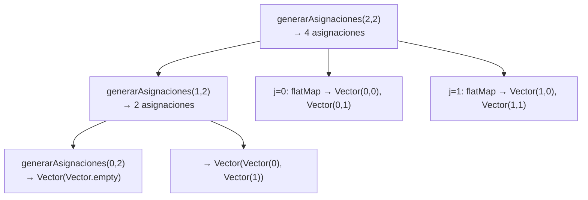
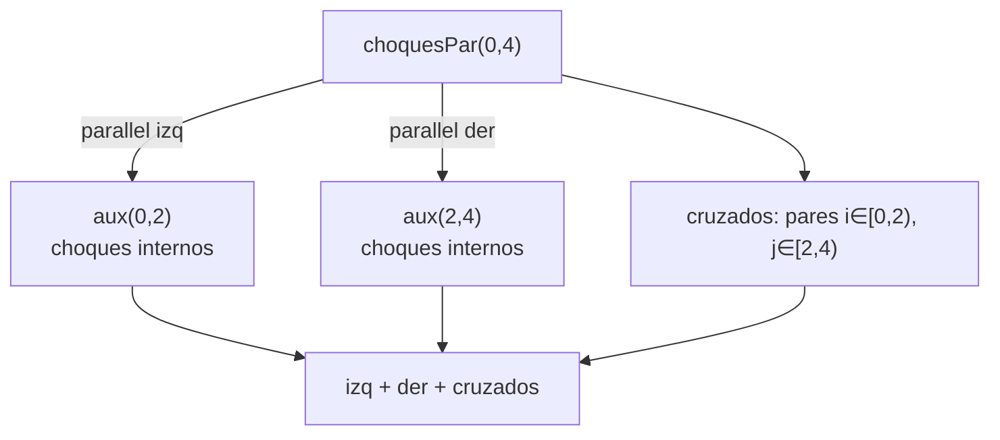
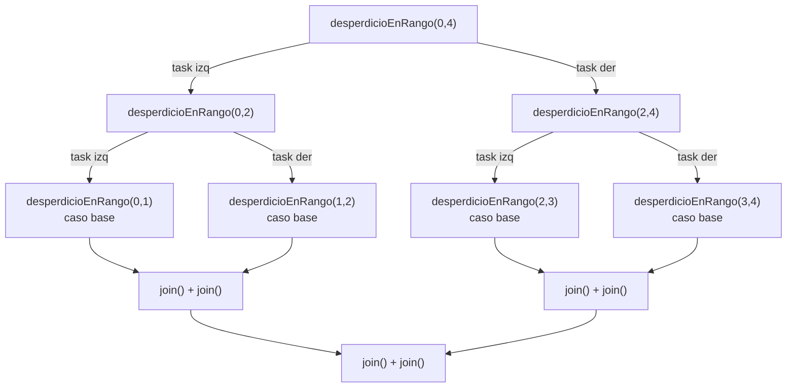
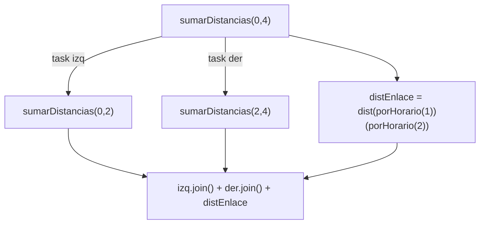
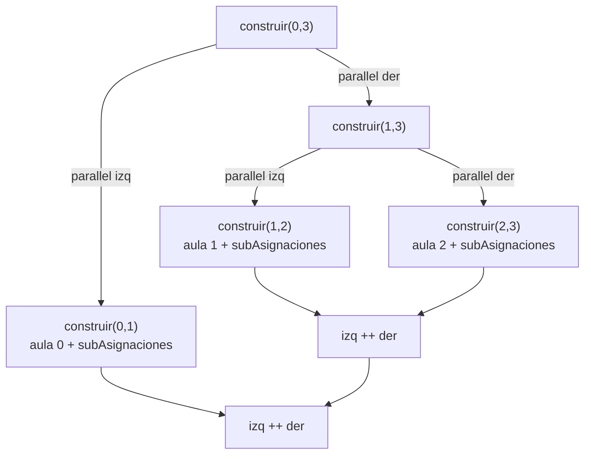
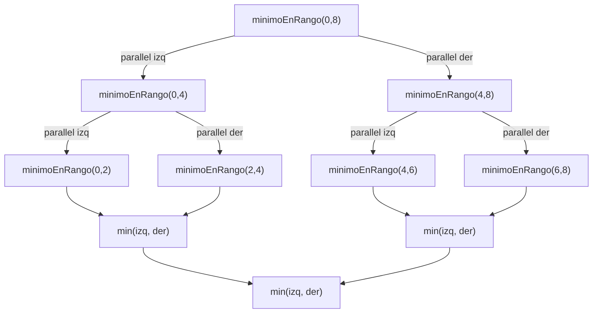

# Informe de Proceso — Proyecto Final

## Integrantes del grupo

| Nombre completo              | Código    | Correo institucional                              |
|------------------------------|-----------|---------------------------------------------------|
| Aura Maria Pelaez Luna       | 202459422 | aura.pelaez@correounivalle.edu.co                |
| Valentina Valencia Lopez     | 202459626 | valentina.valencia.lopez@correounivalle.edu.co   |

---

## 1. `solapan`

### Descripción
Función no recursiva que determina si dos cursos se solapan en el tiempo usando la condición $\text{ini}_1 < \text{fin}_2 \land \text{ini}_2 < \text{fin}_1$.

### Ejemplo de proceso

Cursos: `C1 = ("C1", 0, 4, 30)` y `C2 = ("C2", 2, 6, 20)`.

```
solapan(C1, C2)
  c1EmpiezaAntesDeQueFinalice2 = (0 < 6) = true
  c2EmpiezaAntesDeQueFinalice1 = (2 < 4) = true
  → true
```

Cursos: `C1 = ("C1", 0, 4, 30)` y `C3 = ("C3", 5, 8, 15)`.

```
solapan(C1, C3)
  c1EmpiezaAntesDeQueFinalice2 = (0 < 8) = true
  c2EmpiezaAntesDeQueFinalice1 = (5 < 4) = false
  → false
```

---

## 2. `choques`

### Descripción
Función que recorre todos los pares $(i,j)$ con $i < j$ usando `flatMap` y `map` sobre los índices, contando los pares que comparten aula y se solapan.

### Proceso de evaluación — ejemplo pequeño

Cursos: `Vector(("C1",0,4,30), ("C2",2,6,20), ("C3",5,8,15))`, asig: `Vector(0,0,1)`.

```
choques(cursos, Vector(0,0,1))

  i=0, j=1: asig(0)==asig(1)==0, solapan(C1,C2)=true  → 1
  i=0, j=2: asig(0)=0 != asig(2)=1                    → 0
  i=1, j=2: asig(1)=0 != asig(2)=1                    → 0

  sum(1,0,0) → 1
```

### Tabla de pares evaluados

| i | j | asig(i) | asig(j) | solapan | choque |
|---|---|---------|---------|---------|--------|
| 0 | 1 | 0       | 0       | true    | 1      |
| 0 | 2 | 0       | 1       | —       | 0      |
| 1 | 2 | 0       | 1       | —       | 0      |

**Resultado:** `choques = 1`

---

## 3. `capacidadFallida`

### Descripción
Función que usa `indices.count` para contar cuántos cursos asignados tienen un aula con capacidad menor al número de estudiantes.

### Proceso de evaluación — ejemplo pequeño

Cursos: `Vector(("C1",0,4,30), ("C2",2,6,20))`, aulas: `Vector(("A1",25), ("A2",40))`, asig: `Vector(0,1)`.

```
capacidadFallida(cursos, aulas, Vector(0,1))

  i=0: asig(0)=0 >= 0, cap(A1)=25 < est(C1)=30  → falla = true
  i=1: asig(1)=1 >= 0, cap(A2)=40 >= est(C2)=20 → falla = false

  count(true, false) → 1
```

| i | aula | cap | est | falla |
|---|------|-----|-----|-------|
| 0 | A1   | 25  | 30  | true  |
| 1 | A2   | 40  | 20  | false |

**Resultado:** `capacidadFallida = 1`

---

## 4. `desperdicio`

### Descripción
Función que filtra los cursos donde la capacidad es mayor o igual a los estudiantes, luego mapea la diferencia y suma.

### Proceso de evaluación — ejemplo pequeño

Cursos: `Vector(("C1",0,4,30), ("C2",2,6,20))`, aulas: `Vector(("A2",40))`, asig: `Vector(0,0)`.

```
desperdicio(cursos, aulas, Vector(0,0))

  i=0: cap(A2)=40 >= est(C1)=30 → incluir, sobra = 40-30 = 10
  i=1: cap(A2)=40 >= est(C2)=20 → incluir, sobra = 40-20 = 20

  sum(10, 20) → 30
```

| i | cap | est | incluido | sobra |
|---|-----|-----|----------|-------|
| 0 | 40  | 30  | sí       | 10    |
| 1 | 40  | 20  | sí       | 20    |

**Resultado:** `desperdicio = 30`

---

## 5. `movilidad`

### Descripción
Función que filtra los cursos asignados, los ordena por hora de inicio, y usa `sliding(2)` para sumar las distancias entre aulas de cursos consecutivos.

### Proceso de evaluación — ejemplo pequeño

Cursos: `Vector(("C1",0,4,30), ("C2",2,6,20), ("C3",5,8,15))`, asig: `Vector(0,1,2)`.

Ordenados por ini: C1(ini=0)→aula 0, C2(ini=2)→aula 1, C3(ini=5)→aula 2.

dist: `Vector(Vector(0,5,10), Vector(5,0,7), Vector(10,7,0))`.

```
movilidad(cursos, aulas, dist, Vector(0,1,2))

  asignados ordenados: [0, 1, 2]

  sliding(2):
    par [0,1]: d(asig(0), asig(1)) = d(0,1) = 5
    par [1,2]: d(asig(1), asig(2)) = d(1,2) = 7

  sum(5, 7) → 12
```

| par     | aula i | aula j | distancia |
|---------|--------|--------|-----------|
| (C1,C2) | 0      | 1      | 5         |
| (C2,C3) | 1      | 2      | 7         |

**Resultado:** `movilidad = 12`

---

## 6. `costoAsignacion`

### Descripción
Función no recursiva que combina las cuatro penalizaciones multiplicadas por sus pesos:

$$\text{costo} = w_{CH} \cdot \text{choques} + w_{CF} \cdot \text{capacidadFallida} + w_{DE} \cdot \text{desperdicio} + w_{MV} \cdot \text{movilidad}$$

### Proceso de evaluación — ejemplo

Cursos: `cursosEj1`, aulas: `aulasEj1`, asig: `Vector(0,1,0)`, pesos: `(1000,100,1,2)`.

```
costoAsignacion(cursosEj1, aulasEj1, distEj1, Vector(0,1,0), (1000,100,1,2))

  choques          = 0  → 1000 * 0  =  0
  capacidadFallida = 0  →  100 * 0  =  0
  desperdicio      = 25 →    1 * 25 = 25
  movilidad        = 6  →    2 * 6  = 12

  total = 0 + 0 + 25 + 12 = 37
```

| Componente       | Valor | Peso | Subtotal |
|------------------|-------|------|----------|
| choques          | 0     | 1000 | 0        |
| capacidadFallida | 0     | 100  | 0        |
| desperdicio      | 25    | 1    | 25       |
| movilidad        | 6     | 2    | 12       |
| **total**        |       |      | **37**   |

---

## 7. `generarAsignaciones`

### Descripción
Función recursiva que genera todas las posibles asignaciones $\{0,\ldots,m-1\}^n$: caso base (n=0) retorna `Vector(Vector.empty)`, caso recursivo genera las sub-asignaciones para n−1 cursos y antepone cada aula posible usando `flatMap`.

### Árbol de llamadas — ejemplo: n=2, m=2



### Tabla de expansión

| Llamada                  | Resultado                                                    |
|--------------------------|--------------------------------------------------------------|
| generarAsignaciones(0,2) | `Vector(Vector())`                                           |
| generarAsignaciones(1,2) | `Vector(Vector(0), Vector(1))`                               |
| generarAsignaciones(2,2) | `Vector(Vector(0,0), Vector(0,1), Vector(1,0), Vector(1,1))` |

---

## 8. `asignacionOptima`

### Descripción
Genera todas las asignaciones con `generarAsignaciones`, mapea cada una a su costo con `costoAsignacion`, y retorna la de menor costo con `minBy`.

### Proceso de evaluación — ejemplo: 2 cursos, 2 aulas, pesos (1,1,1,1)

```
generarAsignaciones(2,2)
  .map(a => (a, costoAsignacion(..., a, pesos)))
  .minBy(_._2)

  Vector(0,0) → costo c0
  Vector(0,1) → costo c1
  Vector(1,0) → costo c2
  Vector(1,1) → costo c3

  minBy → tupla con menor costo
```

---

## 9. Funciones paralelas: estrategia de división

### 9.1 `choquesPar`

Divide el rango `[desde, hasta)` en dos mitades con `parallel`. Cada mitad calcula sus choques internos. Adicionalmente se calculan los **choques cruzados** entre elementos de la mitad izquierda y la derecha.



### 9.2 `desperdicioPar`



### 9.3 `movilidadPar`

Divide el vector `porHorario` en dos mitades. La combinación suma los resultados **más la distancia de enlace** entre el último elemento de la mitad izquierda y el primero de la derecha.



### 9.4 `generarAsignacionesPar`

Divide el rango de valores de aula `[0, m)` para el primer curso en dos mitades con `parallel`. Las sub-asignaciones para los n−1 cursos restantes se generan recursivamente.



### 9.5 `asignacionOptimaPar`


Divide el vector de candidatas en dos mitades con `parallel`. Cada mitad busca su mínimo local y al final se compara cuál tiene menor costo.

